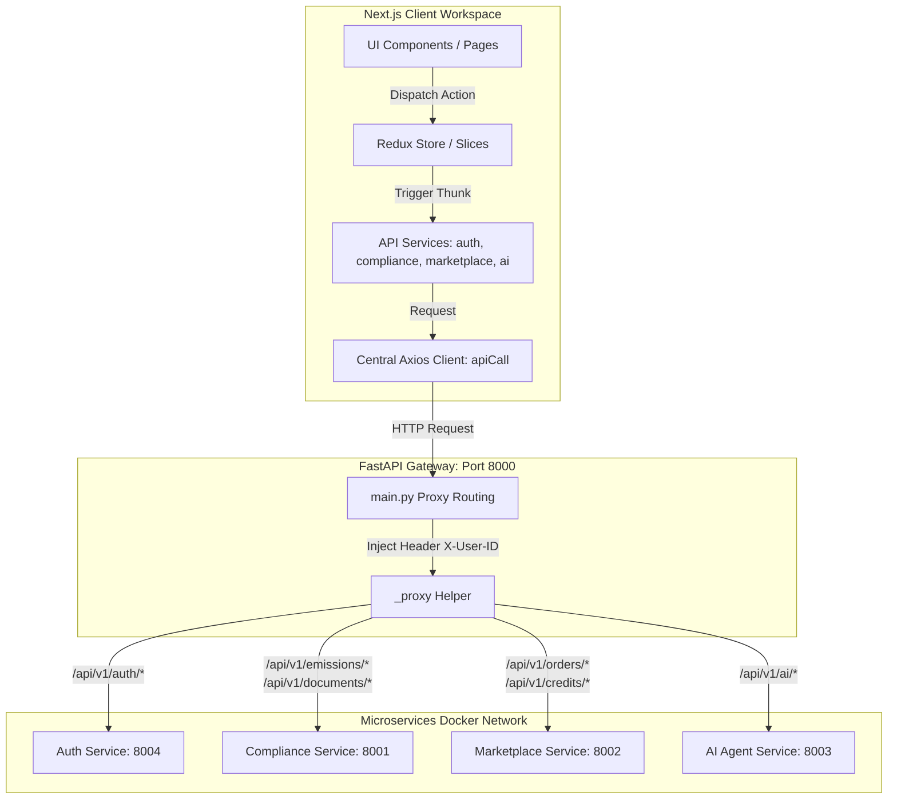

# IndiCarbon API Connectivity & Agent Skills Walkthrough

This document outlines the design decisions and implementation details for connecting the IndiCarbon frontend to the backend microservices via the API Gateway using Redux for state management, Axios for data transport, and TypeScript for compile-time safety.

---

## 1. System Architecture Diagram

The diagram below details the flow of data from the frontend components through Redux, the centralized Axios client, the API Gateway proxy, and finally the downstream Python microservices.

---

## 2. API Routing Table & Gateway Proxies

To align the frontend calls with the backend service schemas, we fixed routing mismatches in the API Gateway (`apps/backend/services/gateway/main.py`) by adding explicit proxies for:
1. **Documents**: `/api/v1/documents/{path:path}` forwarded to the Compliance Service (8001).
2. **Orders**: `/api/v1/orders/{path:path}` forwarded to the Marketplace Service (8002).
3. **Credits**: `/api/v1/credits/{path:path}` forwarded to the Marketplace Service (8002).
4. **AI Document Analysis**: Added a gateway-friendly endpoint `@router.post("/api/v1/ai/analyse-document")` in `routes.py` to match the `/api/v1/ai/` proxy route in the gateway.

Here is the finalized routing mapping:

| Gateway Endpoint | Upstream Target | Target Endpoint | Description |
| :--- | :--- | :--- | :--- |
| `/api/v1/auth/*` | Auth Service (8004) | `/api/v1/auth/*` | Login, Registration, Token Verification |
| `/api/v1/emissions/*` | Compliance Service (8001) | `/api/v1/emissions/*` | Emission ledger submission & summary |
| `/api/v1/documents/*` | Compliance Service (8001) | `/api/v1/documents/*` | Document Vault upload metadata & verification |
| `/api/v1/orders/*` | Marketplace Service (8002) | `/api/v1/orders/*` | Place Buy/Sell orders |
| `/api/v1/credits/*` | Marketplace Service (8002) | `/api/v1/credits/*` | List owner carbon credit portfolio |
| `/api/v1/ai/*` | AI Agent Service (8003) | `/api/v1/ai/*` & `/api/v1/*` | LangGraph multi-agent run, RAG, history |

---

## 3. Redux State & Argument Passing Flow

To maintain a single source of truth, all dashboard widgets load and store their metrics using Redux Toolkit slices:

* **`auth-slice.ts`**: Coordinates JWT authentication. Automatically recovers session state on client boot via `initializeAuth()` and logs out dynamically when receiving a `401 Unauthorized` response.
* **`compliance-slice.ts`**: Manages current organizational emissions totals (Scope 1, 2, and 3), factor mapping tables, document listings, and BRSR generation.
* **`marketplace-slice.ts`**: Coordinates the order book placements and matches, storing transaction responses and available credit listings.
* **`ai-slice.ts`**: Handles RAG chat history lists, active streaming/responses, LangGraph node progress, and the registry of active autonomous agents.

---

## 4. Agent Skills & Governance Rules

We created a dedicated `.skills` folder in the project root:
* **`.skills/agent_skills.ts`**: Exposes a registry of modular "skills" mapping raw JSON inputs from AI agents into execution-ready REST API operations using our central client.
* **`.skills/rules.md`**: Enforces strict backend development guidelines (such as Pydantic models with schema details, token verification) and frontend styling practices (HSL dark-mode themed designs, glassmorphic layout, micro-animations, standard typography).
