# Live Voice Mode (Zero UI Agent)

This document provides a detailed overview of the design, architecture, and implementation of the **Live Voice Mode** (Zero UI Agent) feature on the IndiCarbon platform.

---

## 1. Overview

The Live Voice Mode allows users to interact with the IndiCarbon AI Agent entirely using their voice. It switches the standard chat panel to a minimalist **Zero UI** interface featuring a pulsing, glowing orb and audio waves that change shape based on whether the agent is listening, thinking, or speaking.

Behind the scenes, the feature leverages the **Sarvam AI** speech platform for low-latency streaming:
* **Speech-to-Text (STT):** Streams user microphone audio to Sarvam's `saaras:v3` model.
* **Agentic Execution:** Feeds transcripts to the main LangGraph agentic reasoning loop.
* **Text-to-Speech (TTS):** Converts agent text responses into natural English-Indian (`en-IN`) voice chunks using Sarvam's `bulbul:v3` model.

---

## 2. Architecture & Data Flow

Below is a sequence diagram showcasing how the browser, Main API Gateway, AI-Agent Service, and Sarvam AI communicate in real time over WebSockets:

```mermaid
sequenceDiagram
    autonumber
    actor User
    participant Browser as Browser Client
    participant Gateway as API Gateway (Port 8000)
    participant Agent as AI-Agent Service (Port 8003)
    participant Sarvam as Sarvam AI WebSocket

    User->>Browser: Clicks "Voice Mode"
    Note over Browser: AudioContext initialized synchronously<br/>to prevent browser suspension blocks
    Browser->>Gateway: WebSocket Connection (/api/v1/ai/voice)
    Gateway->>Agent: Proxies WebSocket Tunnel
    Note over Agent: Authenticates token using Auth Service

    rect rgb(30, 41, 59)
        Note over Browser, Agent: Listening Phase
        Browser->>Browser: Mic captured via getUserMedia
        Browser->>Browser: Manual Downsampling to 16kHz + 1.5x Gain
        loop Continuous Binary Stream
            Browser->>Agent: Raw Int16 PCM Chunks (16000Hz, Mono)
            Agent->>Sarvam: Base64 STT stream (saaras:v3)
        end
        Sarvam->>Agent: Signal: END_SPEECH (VAD detected)
        Agent->>Browser: JSON: status = "thinking"
    end

    rect rgb(20, 35, 60)
        Note over Agent, Agent: Thinking Phase
        Note over Agent: Checks out a short-lived SQLAlchemy Session
        Agent->>Agent: Runs LangGraph Agent (run_chat)
        Note over Agent: Executes Tools (Emissions, Wallet, Trading)
        Agent->>Browser: JSON: status = "speaking"
    end

    rect rgb(35, 20, 50)
        Note over Browser, Sarvam: Speaking Phase
        Agent->>Agent: Strips Markdown formatting & splits sentences
        Agent->>Sarvam: Connects to bulbul:v3 socket
        loop Text Sentence Chunks
            Agent->>Sarvam: text chunk
            Sarvam->>Agent: 24kHz Linear16 Audio binary chunks
            Agent->>Browser: JSON: audio = Base64 PCM data
            Browser->>Browser: PCMPlayer queues & schedules chunk
        end
        Agent->>Browser: JSON: playback_complete
        Agent->>Browser: JSON: status = "listening"
    end
```



---

## 3. Core Features & Technical Details

### A. Front-end Audio Pipeline & Processing
To make real-time audio capture and playback performant, robust, and clean in the browser, the frontend implementing Web Audio API utilizes the following pipeline:

1. **User Gesture Activation:**
   Creating and resuming `AudioContext` requires a direct user click. The page instantiates and initializes `PCMPlayer` inside the synchronous `startVoiceMode` handler, avoiding browser silent-block mechanisms.
2. **Microphone Downsampling:**
   Many browsers ignore requested sample rates in `new AudioContext({ sampleRate: 16000 })` and fall back to the hardware sample rate (e.g. 44.1kHz or 48kHz). The code downsamples microphone float buffers to `16000Hz` using a box filter to guarantee correct speed and pitch for Sarvam AI.
3. **Gain Control:**
   A Web Audio `GainNode` with a `1.5x` amplification factor is chained to the mic capture node to improve transcription accuracy under low-microphone-volume settings.
4. **DataView Playback Scheduling:**
   Linear16 24kHz audio chunks are decoded using JavaScript's `DataView` instead of `Int16Array` constructor wrappers. This avoids `RangeError` alignments on odd-byte buffers and guarantees little-endian parsing. Chunks are scheduled sequentially (`source.start(nextStartTime)`) without gaps or latency pops.

### B. Graceful Interrupt (Barge-in) Handling
A key requirement of natural speech agents is the ability to interrupt the bot mid-response. 
* **Trigger:** When the user clicks the visualizer orb during `thinking` or `speaking` states, the client sends a `{"type": "interrupt"}` message and cancels local audio playback.
* **Backend Cancellation:** The backend listens concurrently for client WebSocket packets during the execution of `run_chat` or TTS generation. If an `interrupt` is detected:
  * The active LangGraph task is cancelled.
  * The TTS WebSocket streaming is terminated.
  * The agent immediately returns a `listening` status to begin transcribing the user's new request.

### C. Text Cleaning for Natural Speaking
Before sending generated agent responses (which contain tables, bullet lists, markdown dividers, and bold/italic tags) to the TTS service, the text is run through a pre-processor:
* Markdown bold (`**`), italic (`*`/`_`), and headers (`#`) are stripped.
* Markdown divider lines (`---`) and horizontal rules are ignored.
* Data tables (lines containing pipe symbols `|`) are skipped entirely to prevent spelling out raw table characters.
* Chunks are parsed and separated by newlines and sentence punctuation, reducing TTS time-to-first-byte (TTFB).

### D. Safe Database Session Management
FastAPI WebSockets are long-lived, which can cause SQLAlchemy connection pool exhaustion (`TimeoutError: QueuePool limit reached`) if a database session dependency remains checked out.
* The endpoint utilizes `db_context = contextmanager(get_db)` to dynamically check out a database session inside the `while True` loop *only* when the agent is executing.
* The session commits and closes immediately when the agent finishes executing, releasing the connection back to the database pool.

---

## 4. Environment Configuration

To run the voice agent, ensure the following environment keys are loaded:
```env
# .ai-agent.env (apps/backend/services/ai-agent/.envs/)
SARVAM_API_KEY=sk_ivgjiuyg_szEyra46rorgbC3xgddqw6IP
APP_ENV=development
```
